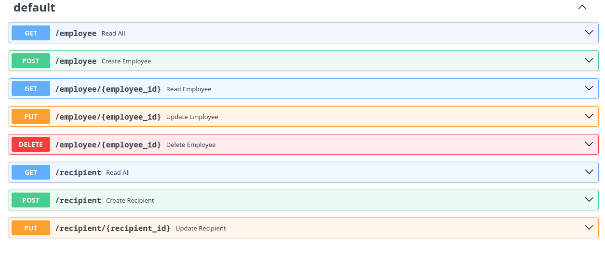

# FastAPI demo: beneficiaries and employees CRUD

This API allows for the registration of N number of beneficiaries to employees, while assigning a participatory percentage of the employee's life insurance. The API provides endpoints to add, modify, and delete employees, as well as add, modify, and delete beneficiaries for existing employees.

For an employee, the API stores information such as name, surname, date of birth (with validation to ensure they are of legal age), employee number, CURP (Unique Population Registry Code in Mexico), SSN (Social Security Number), phone number (with validation for a 10-digit format), and nationality.

Additionally, for a beneficiary, the API stores information such as name, surname, date of birth (with validation to ensure they are of legal age), CURP (Unique Population Registry Code in Mexico), SSN (Social Security Number), phone number (with validation for a 10-digit format), nationality, and participation percentage.

It is important to note that the sum of all "Participation percentages" for the beneficiaries must always equal 100. The API can be tested using the provided URL: http://127.0.0.1:8000/docs.

## Installation

1. Clone the repository:

```
   git clone https://github.com/agent3dev/FastAPI_CRUD_demo.git
```  
Create a virtual environment:

```
python -m venv env
```

Activate the virtual environment:

For Windows:

bash
Copy
.\env\Scripts\activate
For macOS and Linux:

bash
Copy
source env/bin/activate
Install the required dependencies:

```
pip install -r requirements.txt
```

MySQL Database Setup:

Login in a root in your MySQL or MariaDB CLI and create a MySQL user and grant necessary privileges.

```
CREATE USER 'localuser'@'localhost' IDENTIFIED BY 'localpassword';
CREATE SCHEMA fapi_crud_db;
GRANT ALL PRIVILEGES ON `fapi_crud_db`.* TO 'localuser'@'localhost';
FLUSH PRIVILEGES; 
EXIT;
```

Create the database schemas.

```
DROP TABLE IF EXISTS `employee`;
CREATE TABLE `employee` (
  `id` int(11) NOT NULL AUTO_INCREMENT,
  `name` varchar(255) DEFAULT NULL,
  `lastnames` varchar(255) DEFAULT NULL,
  `date_of_birth` date DEFAULT NULL,
  `employee_number` int(11) DEFAULT NULL,
  `CURP` varchar(25) DEFAULT NULL,
  `SSN` varchar(25) DEFAULT NULL,
  `phone_number` varchar(10) DEFAULT NULL,
  `nationality` varchar(25) DEFAULT NULL,
  PRIMARY KEY (`id`),
  KEY `ix_employee_id` (`id`)
) ENGINE=InnoDB DEFAULT CHARSET=utf8mb4 COLLATE=utf8mb4_unicode_ci;
/*!40101 SET character_set_client = @saved_cs_client */;


DROP TABLE IF EXISTS `recipient`;
CREATE TABLE `recipient` (
  `id` int(11) NOT NULL AUTO_INCREMENT,
  `name` varchar(255) DEFAULT NULL,
  `lastnames` varchar(255) DEFAULT NULL,
  `date_of_birth` date DEFAULT NULL,
  `CURP` varchar(25) DEFAULT NULL,
  `SSN` varchar(25) DEFAULT NULL,
  `phone_number` varchar(10) DEFAULT NULL,
  `nationality` varchar(25) DEFAULT NULL,
  `benefit_percent` int(11) DEFAULT NULL,
  `employee_id` int(11) DEFAULT NULL,
  PRIMARY KEY (`id`),
  KEY `employee_id` (`employee_id`),
  KEY `ix_recipient_id` (`id`),
  CONSTRAINT `recipient_ibfk_1` FOREIGN KEY (`employee_id`) REFERENCES `employee` (`id`) ON DELETE CASCADE
) ENGINE=InnoDB DEFAULT CHARSET=utf8mb4 COLLATE=utf8mb4_unicode_ci;
```

Configuration
Update the configuration file database.py with your MySQL database credentials (in case you changed the defaults).

Usage
Start the FastAPI server using Uvicorn:

```
uvicorn main:app --reload
```

Open your browser and navigate to http://127.0.0.1:8000/docs to access the API documentation and test the endpoints.

API Endpoints



License
This project is licensed under the MIT License. Feel free to customize the README further based on your project's specific details and requirements.